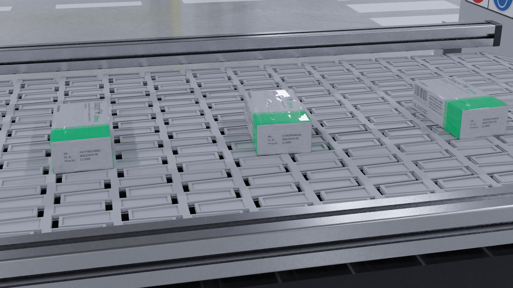

# Procedural 3D Image Generation with Blender
This is a PoC (Proof-of-concept) repository demonstrating how Blender can be leveraged to create synthetic machine learning training data for computer vision tasks.



## Scenario

The goal of this project is to simulate a factory plant that produces pharmaceutical products. The machine used sometimes produces damaged packages that are dented. The packs move on a conveyor belt along an inspection line where two cameras are mounted (top and side). The goal is to find a machine learning model that can detect damaged and intact packages. This repository contains the code to create the dataset, it doesn not contain code for the machine learning model.

## How To generate the dataset

### Prerequisites
Make sure the following software is installed on your computer:

- <a href="https://www.python.org/downloads/" target="_blank">Python</a> >= 3.6 (including pip)
- <a href="https://www.blender.org/download/">Blender</a> >= 2.83

Install python dependencies by opening up your command prompt or terminal and type in

  ```
  pip install -r requirements.txt
  ```

Next open open `pipeline.py` in a text editor and change the output path (`file_base_path`) and the number of images (`num_images`) that should be produced. NOTE: Rendering images can take time, start with 1 or 2 to see if the result meets your expectations.

### Run Pipeline

In a command prompt or terminal run
  ```
  python pipeline.py
  ```
  
 to start the pipeline. This will do the following:
 
 1) It produces a new image Wrapping.png based on Template.png with a random serial number and batch number.
 2) pipeline.py calls blender in a subshell and opens Package.blender. This file contains the base scene with a sample medicine package using Wrapping.png as image texture. Additionally, the script `blenderBackgroundTask.py` will be executed in Blender's context.
 3) `blenderBackgroundTask.py` adds random brush strokes ("DRAW") to the package that dent the package. The brush strokes follow a random Bézier curve.
 4) Random variations to the location and rotation of the object are added
 5) Finally, two images of the same package are rendered and stored in the folders "damaged" and "intact": From the top and the side. The image names follow the schema {serial_number}_{camera_position}.png
